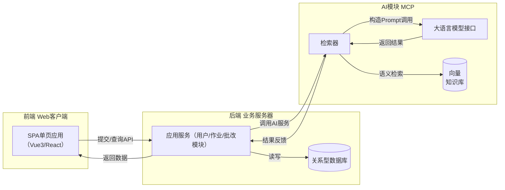

# 智能作业助手网站 – 概要设计文档

本概要设计文档概述了“智能作业助手”网站的整体架构、模块组成、技术选型与部署策略，以及主要功能流程。在设计中充分考虑了系统的可维护性、扩展性，以及AI模块设计的合理性与实用性（包括MCP模块、多智能体分工、RAG机制等），以确保满足软件工程课程对完整性、规范性和可读性的要求。

## 系统整体架构设计

本系统采用分层模块化的架构设计，以保障维护性和拓展性。整体上分为前端、后端业务逻辑、AI智能模块（MCP）三大部分，另有数据库和知识库支撑，各部分通过明确的接口进行交互：

* **前端（Web 客户端）**：前端负责页面展示和用户交互逻辑，是基于单页应用的Web界面。采用现代前端框架（如Vue3 + TypeScript），区分学生端和教师端界面，通过组件化实现功能模块。例如学生端包括作业列表、作业提交页面、批改结果查看页面、AI对话窗口等；教师端包括作业发布管理、批改界面、成绩总览等。前端通过调用后端提供的RESTful API（或GraphQL接口）进行数据通信，并在用户操作时给予及时反馈（如提交作业时的加载提示、AI回复的逐字显示）。前端资源将部署在云端，通过 HTTPS 提供安全访问。

* **后端（业务服务器）**：后端是核心业务应用，承担用户管理、作业管理、批改流程控制、对话处理等逻辑。后端采用MVC架构或基于微服务的架构，将不同功能划分为若干模块：用户模块处理注册登录和权限验证，作业模块处理教师发布作业和学生提交记录，批改模块负责协调调用AI进行作业批改，聊天模块处理学生与AI对话等。后端通过关系型数据库存储系统数据，包括用户账号、作业信息、提交答案、成绩反馈等。当教师触发批改时，后端会将学生答案和参考答案打包发送给AI模块MCP以请求批改服务，拿到结果后保存反馈供教师审核；类似地，学生在AI对话窗口提出问题时，由后端转发请求到MCP获取回答。后端所有接口均实施严格的权限控制，仅允许合法用户调用对应功能（例如只有教师权限才能调用批改相关接口）。此外，为提高性能和用户体验，后端对于耗时操作支持异步处理机制：如将批改任务放入消息队列异步执行，避免阻塞主线程。整个后端可按单体架构部署以简化开发，也支持根据需要演进为微服务架构（各模块通过内部API或消息总线通信）。

* **MCP模块（AI大模型与知识库接口）**：MCP模块即“Model Compute/Control Platform”，专门负责与大语言模型的交互，并结合\*\*检索增强生成（RAG）\*\*技术提供智能服务支持。MCP模块内部进一步划分为多个子组件（**智能体**），分别对应不同的AI功能需求：

  * **检索器**：负责连接系统的知识库，根据用户提问或批改需求从知识库中检索相关背景内容。知识库可包含课程教材、题库解析、历史优秀答案等，由开发团队预先构建并存储在向量数据库中，以便通过相似度搜索获取相关资料。检索器将查询到的结果作为提示信息嵌入到发送给大模型的Prompt中，以提高生成答案的准确性和依据的可靠性。
  * **大模型接口**：负责对接选定的底层大语言模型（例如OpenAI的GPT-4 API，或本地部署的开源模型如DeepSeek/ChatGLM等）。该接口将整理好的Prompt（包含用户问题或学生答案+参考答案+检索内容等）发送给大模型，并获取生成结果。为实现不同功能，此接口封装了多种Prompt模板，例如批改评分提示词模板、解题提示模板、错因分析模板等，根据不同任务调用同一底层模型但使用不同的提示词，从而得到符合该任务要求的回复。
  * **任务智能体**：针对系统提供的不同AI功能，实现不同的智能体模块。例如：“**批改智能体**”接收学生答案和参考答案，调用检索器获取相关知识后，使用批改Prompt模板请求大模型，生成该学生作业的评分和详细反馈；“**提示智能体**”根据题目请求检索相关知识并调用提示类Prompt，为学生提供解题思路提示；“**讲解智能体**”根据学生提出的关于错误原因的提问，结合其答案、标准答案和相关知识，调用讲解类Prompt生成进一步的讲解和辅导。未来还可扩展如“出题智能体”等其他功能。每个智能体通过检索器获得知识支撑，再调用大模型得到结果并返回给后端业务模块。采用多智能体设计使不同AI功能解耦，便于分别优化和扩展新的能力。
  * **知识库管理**：知识库由课程相关资料构成，如课程讲义、题目解析、参考答案集合等。开发时对这些资料进行预处理（如提取文本要点）并存入向量数据库（如 Milvus 等）以支持快速语义检索。知识库部署在服务器端，确保数据可控可靠，且不会侵犯学生隐私（不会将学生作业内容用于模型训练或外部用途）。开发过程中需要评估检索增强（RAG）对系统性能和回答准确性的提升情况，并权衡知识库规模增长对检索速度的影响。

* **数据库**：系统使用关系型数据库（如 MySQL）来保存主要业务数据，包括用户、作业、提交、成绩反馈等表。数据库设计遵循规范的范式，建立必要的主键和外键关联，以支持如下关系：一个教师可以发布多个作业；一个作业可对应多个学生提交记录；每个学生对每份作业可有多次提交（例如允许重交或分题多次提交）。此外，对于学生上传的附件和图片，系统采用云存储（如对象存储服务）保存文件，数据库中仅记录文件访问路径。同时，向量化的知识库内容存储在专门的向量数据库中（如 Milvus），或在小规模时由后端进程内存缓存，以便进行相似度向量检索。所有对数据的存取均通过后端服务层提供的接口进行，前端不会直接访问数据库，以保证数据安全和一致性。

上述架构各部分通过清晰的接口契约进行交互，既实现了前后端分离又将AI能力模块化。**MCP模块**作为AI能力的统一接口，使得底层的大模型或知识源可以灵活替换升级，而不影响系统其它部分。这种松耦合设计保证了系统具有良好的可维护性和扩展性。

*图：* 智能作业助手系统总体架构示意。前端通过API与后端交互，后端调用MCP模块与大模型和知识库通信，数据库和向量知识库存储业务数据和语义向量，实现各部分松耦合协作。

## 模块划分说明

根据上述架构设计，系统主要功能模块划分如下：

* **用户与权限模块**：提供用户账户注册、登录功能，以及权限管理。支持学生和教师两种角色，不同角色进入不同界面并拥有不同操作权限。用户模块负责密码加密存储、身份认证（例如基于JWT的令牌机制）、会话管理等，确保系统资源只有经过验证的用户才能访问。教师账号的注册可能需要额外审核或邀请码验证，以防止学生冒充教师。

* **作业管理模块**：教师可通过该模块发布新的作业，包括录入作业标题、描述、截止日期，以及参考答案或评分标准等信息。发布后，学生可浏览作业列表并查看详情。教师可以在截止日期后查看所有学生的提交情况。该模块还负责在作业到期或批改完成后更新作业状态（如“进行中”、“已截止”、“已批改”等）。

* **作业提交与记录模块**：学生通过前端提交作业答案（文本输入或文件上传），后端接收提交请求后保存提交记录。每条提交记录关联提交的学生、对应的作业和提交时间等信息。系统支持对同一作业的多次提交时，保留历史记录或仅保存最新一次（视需求决定）。提交模块在接受学生作业时会进行基本校验（如截止日期检查、文件大小格式检查等），并在成功保存后通知教师端有新的作业待批改。

* **批改流程控制模块**：当教师发起AI批改时，由该模块协调调用MCP智能批改功能。具体而言，它获取待批改的学生答案和对应的参考答案，将信息发送给MCP模块请求批改服务，并将AI返回的评分与反馈结果保存下来。该模块还支持教师查看和编辑AI给出的批改结果：教师可对AI的评分或评语进行调整修改，然后确认提交最终成绩。确认后，模块更新提交记录的最终评分状态，并触发通知学生查看结果。

* **AI对话与辅导模块**：该模块处理学生在系统中提出的交互式问题，包括作业撰写过程中向AI寻求提示，或在查看批改反馈后向AI询问错因和获取进一步辅导。前端以聊天对话的形式让学生提问，后端调用MCP模块的相应智能体（如提示智能体或讲解智能体）获取回答，再返回给前端呈现。该模块支持多轮对话，在后端维护对话上下文（例如基于会话ID关联历史问答），实现连续的交流体验。**对话式教学辅助**是本系统的一大特色功能：学生可以就作业相关内容与AI深入交流，以巩固对知识的理解。

* **MCP智能服务模块**：作为AI能力的核心封装模块，提供统一的接口供业务模块调用不同AI功能。内部包含前述的检索器、大模型API接口和各类任务智能体子模块。业务模块无需关心具体AI调用细节，只需调用MCP提供的相应方法（例如`gradeAssignment(submissionId)`或`answerQuestion(question, context)`），即可获得所需AI服务。MCP模块对不同AI任务的实现进行了抽象，保证调用流程的一致性和安全性，并方便地管理AI配置（如Prompt模板、模型API Key等）。

上述各模块通过清晰的接口衔接，既各司其职又紧密配合，实现了从用户操作到AI辅助的完整闭环流程。模块划分清晰合理，使得**AI模块的引入对现有系统影响最小**，同时也为将来新增功能（如更多类型的智能辅助）留下了扩展空间。

## 技术选型与部署策略

在技术选型上，我们优先考虑成熟稳定、易于集成的技术框架，并结合项目需求选择合适的工具。部署上考虑课程项目实际规模，兼顾开发效率与未来扩展。具体如下：

* **前端**：采用 **Vue 3** 框架配合 **Element-Plus** UI组件库构建单页应用界面。选择Vue 3的原因是其成熟生态和组件化开发模式，有利于提高开发效率和代码可维护性。使用 **TypeScript** 提高代码的可靠性和可读性。前端通过 Axios 等库调用后端 API，实现与服务器的数据交互。针对AI对话等实时性需求，方案中考虑使用 **WebSocket** 技术推送AI回复，以实现流式响应，降低用户的等待感知。

* **后端**：后端采用 **Python Django** 框架实现RESTful服务。选择Python技术栈的原因是其丰富的AI和数据处理生态，便于集成调用大模型的API或本地模型库。Django自带ORM和完善的组件，有助于快速构建可靠的业务逻辑。同时通过 **Django REST Framework** 简化API开发和权限管理。如果考虑Java方案，则可使用 **Spring Boot** 快速搭建，并通过HTTP调用独立的Python AI服务来结合模型能力；但在本项目中，Python后端能够直接调用AI库，架构更简单。后端采用**JWT**进行身份认证，集成安全模块确保接口权限控制（如教师权限验证）。为提升性能和可伸缩性，后端可以按需划分为多个服务或使用异步任务队列处理耗时的AI调用。例如采用 Celery + Redis 实现任务异步分发，使批改和问答等耗时任务在后台执行，不阻塞主应用。

* **数据库**：选用 **MySQL** 关系数据库存储结构化数据，包括用户信息、作业、提交记录、成绩反馈等。MySQL在事务处理和查询性能上表现良好，足以应对课程项目的数据规模。通过 Django ORM (或 MyBatis 等在Java方案中) 管理数据库操作，提高开发效率并减少直接编写SQL的错误风险。对于可能的大量文档或JSON数据（如题目解析、AI对话日志），若关系库处理不便，可辅以 **MongoDB** 这类NoSQL数据库存储。不过在本项目中，主要数据均为结构化，可由MySQL统一管理。上传的文件如附件图片则存储在云对象存储（如阿里云OSS或本地文件系统），数据库仅保存其URL路径。此外，选用 **Milvus** 等向量数据库存储知识库的向量表示，以支持高效的语义检索。

* **AI模型**：优先考虑集成 **OpenAI GPT-4/GPT-3.5** 等大型预训练模型，通过其API获取强大的自然语言处理能力。OpenAI模型在作业批改和智能问答方面表现出色，使用云API可以快速实现所需功能。同时，我们关注模型应用的合规性和成本，如有需要可切换为国内开源大模型方案，例如 **DeepSeek LLM** 或 **清华ChatGLM** 等，以确保数据不出境并降低依赖。模型接口通过统一的MCP模块封装，方便更换底层模型而无须修改业务逻辑。我们也将针对本项目设计适当的Prompt模板引导模型行为，使其回答更加贴合教学需求（例如要求口吻像助教、输出包含具体建议等）。

* **部署与集成**：系统计划采用容器化部署方案。前后端应用分别打包为Docker容器，以便于部署和环境一致性。数据库可以使用云上托管的MySQL服务，知识向量库部署为独立服务（容器）以便管理。根据项目规模，初期可在一台云服务器上通过Docker Compose部署所有组件；如果用户量上升，可考虑使用 **Kubernetes** 等容器编排工具在阿里云/腾讯云上进行弹性扩展。部署架构中通过Nginx或API网关转发请求，实现前后端分离部署和负载均衡。我们也将配置简单的CI/CD流程（如GitHub Actions），在代码更新后自动构建并部署容器，减少人工操作。安全方面，所有通信采用HTTPS，服务器部署完善防火墙策略，确保用户数据和隐私安全。总体部署策略在满足课程演示要求的同时，为将来可能的扩展奠定基础。

## 关键流程描述

下面通过几个关键流程的说明，展示系统各模块如何协同工作，特别是前后端与AI MCP模块之间的交互关系。

### 作业提交与通知流程

1. **学生提交作业**：学生在前端作业提交页面填写答案内容或上传附件，然后点击提交。前端调用后端提供的提交API（如`POST /assignments/{id}/submit`），附带作业ID和提交内容等数据。
2. **后端保存记录**：后端收到请求后，首先验证学生身份和作业是否在有效提交时间内（未过截止日期）。若通过验证，则在数据库中创建一条提交记录（包括提交ID、作业ID、学生ID、提交时间、内容存储位置等），状态标记为“未批改”。对于上传的文件，后端将文件保存至文件存储，并记录其路径。
3. **通知教师**：提交成功后，后端返回提交成功的响应给前端，前端提示学生提交完成。与此同时，后端可以通过消息通知机制将新的提交情况告知教师端（例如教师下次请求作业详情或接收实时通知）。教师在其作业管理界面可以看到有哪些学生已提交作业、等待批改。

以上流程确保了学生提交的数据可靠存储，并为后续批改做好准备。提交记录中的状态和时间等信息也为教师了解提交进度提供了支持。

### AI批改流程

1. **教师发起批改**：教师登录后进入某个作业的批改页面，点击“AI批改”按钮以批改该作业的所有提交（或单个提交）。前端调用后端批改API（如`POST /assignments/{id}/grade`），发送要批改的作业或提交的标识。
2. **后端准备数据**：后端收到批改请求后，进入批改流程控制模块。系统检索该作业下所有待批改的提交记录（或指定的提交）以及预先存储的参考答案和评分标准。然后针对每个待批改的提交依次或并行处理：整理该学生的作答案、本题参考答案和评分细则等信息，作为调用AI服务的输入。
3. **调用MCP模块**：后端通过MCP接口将整理好的信息发送给AI批改智能体。例如调用`MCP.grade(studentAnswer, referenceAnswer)`方法。MCP模块的批改智能体接收到请求后，先调用**检索器**在知识库中检索与题目相关的背景知识或解题要点，以丰富批改时模型的上下文（若题目专业性较强，此步骤可提高模型判分的准确性）。随后，批改智能体使用预定义的**批改Prompt模板**封装提问给大模型接口，例如提示内容包括：“请作为助教，根据参考答案对比学生答案，给出评分（0-100）并详细说明扣分原因和改进建议”。MCP将学生答案、参考答案和检索到的知识片段一起发送给大语言模型进行评估。
4. **AI生成结果**：大语言模型接收到Prompt后，生成批改结果，包括该学生答案的分数和相应的评语反馈。通过提示词控制，模型的输出格式可以被约定为结构化形式（例如JSON格式，包含`score`和`feedback`字段），以便于程序解析。模型返回结果给MCP模块。
5. **结果保存与呈现**：MCP批改智能体解析模型输出，将评分数值和文字反馈提取出来，返回给后端批改模块。后端将初步批改结果保存到数据库的反馈记录中（成绩反馈表），并标记该提交记录状态为“AI已批改，待教师复核”。随后后端将该结果通过API接口返回给教师前端，或者在教师批改界面中刷新显示该学生的AI评分和反馈建议。
6. **教师复核调整**：教师查看每个学生的AI批改结果，有权限对不准确的评分或反馈进行修改。例如，如果AI对主观题给分不当，教师可以手动调整分数，或补充修改反馈的措辞。教师在前端界面上逐一审核各学生的结果，进行必要的调整后点击确认提交最终成绩。前端将教师确认后的成绩通过接口发送给后端（如`PUT /submissions/{id}/feedback`）。后端接收后更新数据库中该提交的最终分数和反馈内容，同时将提交状态标记为“已批改”并记录批改完成时间。
7. **学生查看反馈**：一旦教师确认所有批改结果，学生即可在其作业详情页面看到自己的最终得分和详细反馈评语。系统通过通知或前端轮询使学生得知批改完成。学生可以查看每一道题的得失分点和改进建议，实现对作业结果的充分理解。

通过上述批改流程，AI大模型极大提高了初步批改的效率。但同时引入教师复核环节，确保最终成绩的准确性和公平性。整套流程采用异步处理和结果审核机制，实现了**AI自动批改**与**人工监督**的有机结合，既减轻教师负担又保证教学质量。

### AI对话问答流程

1. **学生提出问题**：在学生查看到作业批改结果（或平时练习）后，如果对某题的错因或相关知识点有疑问，可在前端的AI对话窗口输入问题。例如：“这题我哪里理解错了？” 或 “能解释一下参考答案中的原理吗？”。前端将学生的问题、当前上下文（如关联的作业ID、题目ID等）一起通过对话接口发送给后端（例如`POST /assist/chat`，内容包含问题文本和关联的作业/题目信息）。
2. **后端识别意图**：后端对话模块接收到学生的问题后，首先利用上下文确定该问题所涉及的场景。如根据传入的作业ID和题目ID，从数据库查询出该题的学生作答、标准答案，以及相关知识要点等。有了这些上下文数据，系统可以判断学生是在寻求错误原因讲解，属于“错因辅导”类请求。后端据此选择调用MCP模块中的**讲解智能体**来处理该问题。
3. **MCP检索与组装Prompt**：MCP的讲解智能体开始处理时，先使用检索器在知识库中查找与该题相关的知识点说明、教材章节内容或常见错误解析等资料。这些检索到的资料将作为参考信息提供给大模型。一并提供给模型的还有该学生的错误答案摘要和标准答案，组合形成Prompt。例如Prompt可能包含：“学生提问：‘为什么我这题失分？’。题目：…，学生答案：…，参考答案：…。根据上述内容，结合相关知识点，模拟一位导师逐步解释学生出错的原因，以及正确思路。”
4. **大模型生成回答**：大模型接收讲解Prompt后，利用其中提供的知识背景和问答上下文，生成对学生问题的解答。回答内容包括：指出学生答案中的误区，参考正确答案阐明正确的概念或解题方法，并给出进一步的学习建议。这是一种**对话式讲解**，模型可能用较通俗的语言分步骤进行说明，必要时引用知识库中的权威资料来增加可信度。如果学生后续继续追问细节，模型的回答也将考虑之前的对话内容。
5. **结果返回与多轮交互**：MCP将模型生成的回答返回给后端，后端封装为对话消息通过API或WebSocket发送给前端。前端聊天窗口即时显示出AI的回答（若采用流式，可逐字逐句呈现以提升互动感）。此时学生若还有疑问，可以继续输入下一轮问题。系统会将**本轮对话内容追加到上下文**，在后台维护一个对话会话ID以及对应的历史问答记录（可以暂存于缓存，如Redis，保留最近若干轮对话以供模型参考），然后重复步骤2-4处理后续问题。对话过程中，AI始终基于当前作业场景提供针对性的解答，直到学生满意为止。

通过上述对话流程，系统实现了**智能化的作业讲解辅导**：学生和AI可以就作业问题展开深入的多轮交流。这种**对话式教学**功能是本系统的亮点之一，能够帮助学生及时弥补知识盲点，强化对错题的理解。由于引入了检索增强（RAG）机制，AI的回答不仅基于通用大模型能力，还参考了课程知识库中的权威资料，使解释更加准确、有依据。这种互动模式极大提升了学习体验和个性化辅导的效果。