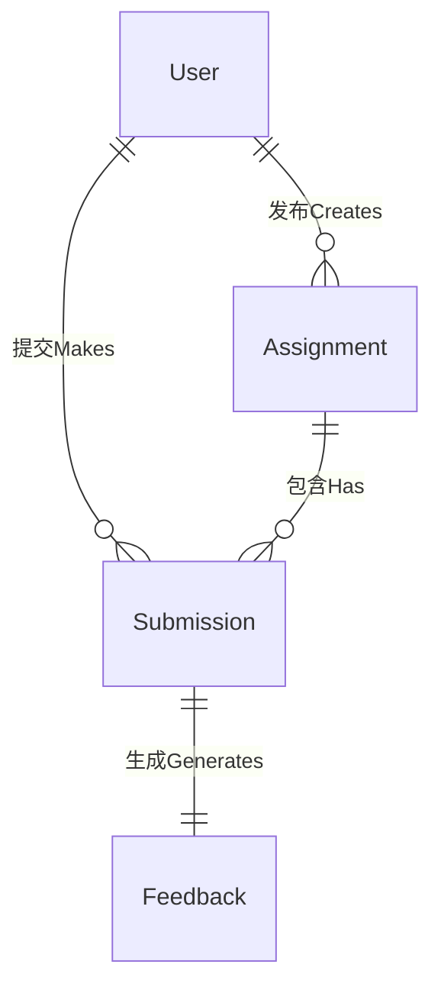
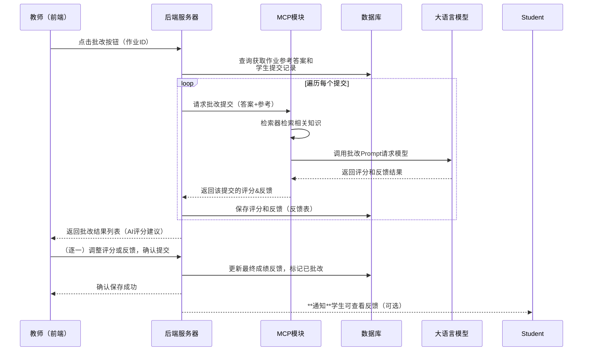
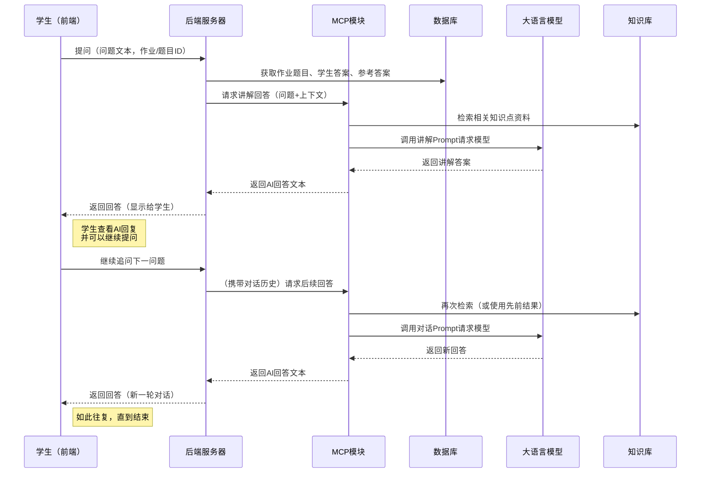
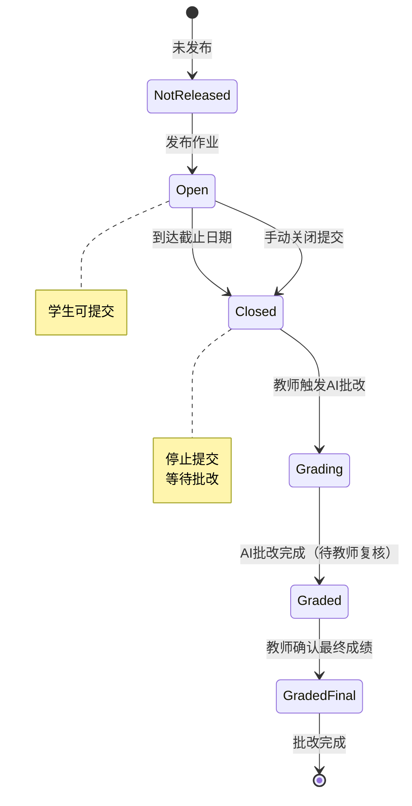

# 智能作业助手网站 – 详细设计文档

本详细设计文档在概要设计的基础上，进一步阐述系统的实现细节。内容包括数据库结构设计、主要接口定义、模块内部结构与关键方法说明，以及核心功能流程的时序图和状态图等。设计充分体现软件工程文档规范，详尽且清晰地描述系统各部分，为后续实现和维护提供指导。

## 数据库结构设计

智能作业助手系统使用关系型数据库来存储主要业务数据。根据需求分析确定的实体和关系，设计了如下主要数据表：

* **User（用户）表**：存储系统用户的基本信息。

  * 主要字段：`user_id` (主键), `name` (姓名), `email`/`username` (登录帐号标识), `password_hash` (密码哈希), `role` (用户角色，枚举：Student/Teacher), `register_time` (注册时间) 等。
  * 说明：每条记录表示一个用户。通过`role`区分学生和教师账户，不同角色权限由系统逻辑控制。

* **Assignment（作业）表**：存储发布的作业任务信息。

  * 主要字段：`assignment_id` (主键), `teacher_id` (发布者教师ID，外键关联User), `title` (作业标题), `description` (作业描述), `due_date` (截止日期), `reference_answer` (参考答案/评分标准，文本或文件路径), `status` (状态：未截止/已截止/批改中/已批改) 等。
  * 说明：每条记录表示一份由教师发布的作业。通过`teacher_id`关联发布该作业的教师用户。`reference_answer`字段保存教师提供的标准答案或评分细则，供批改时AI和教师参考。`status`反映作业当前所处阶段。

* **Submission（提交）表**：存储学生提交的作业答案记录。

  * 主要字段：`submission_id` (主键), `assignment_id` (作业ID，外键关联Assignment), `student_id` (学生ID，外键关联User), `content` (提交内容，文本内容或文件路径), `submit_time` (提交时间), `score` (得分), `feedback` (反馈评语), `status` (状态：已提交/已批改/已确认) 等。
  * 说明：每条记录表示一位学生针对某份作业的一次提交。通过`assignment_id`和`student_id`可以定位是哪位学生的哪次作业。系统允许学生在截止前多次提交作业的话，可增加如`attempt_no`字段标识第几次提交。批改完成后，`score`和`feedback`字段保存AI/教师给出的最终评分和反馈，`status`由“已提交”更新为“已批改”等。

* **Feedback（反馈）表**：存储作业批改的评分与反馈详情（可选设计）。

  * 主要字段：`feedback_id` (主键), `submission_id` (提交ID，外键关联Submission), `score` (评分), `feedback_text` (反馈详细评语), `reviewed` (教师已复核标志，布尔) 等。
  * 说明：此表用于将批改结果从提交记录中拆分出来管理。当AI初步批改完成时插入一条记录保存AI评分和建议反馈，`reviewed=false`表示尚未经过教师确认。教师修改并确认后，可以更新该记录的内容并将`reviewed`置为true，或新增一条表示最终反馈。亦可不使用该表，直接在Submission表中更新分数和反馈字段；采用独立反馈表有助于区分AI原始结果和教师确认结果，以及支持保存多次批改历史。

此外，系统可能需要**Knowledge（知识库）索引**存储，用于检索增强(RAG)时快速查找相关资料。这通常使用向量数据库而非关系型数据库实现：例如有一个向量索引包含若干知识文档，每条含`doc_id`、`content`（原始文本或分段）、`embedding`（向量表示）等。在详细设计中，可将知识库视为外部存储，由MCP模块通过向量检索接口访问。因此这里不作为传统关系表列出。

**数据库关系**：通过外键约束建立如下关系映射——每个*Assignment*记录关联发布者*User*（一对多，一个教师可有多个作业）；每个*Submission*记录关联对应的*Assignment*和提交学生*User*（一个作业有多条提交，一个学生可对应多条提交）；*Feedback*记录与*Submission*一一对应（提交产生反馈）。如下简单ER图描述了主要实体关系：

*图：* 数据库主要实体关系ER图。用户（教师）发布作业，学生进行提交，每次提交生成一条反馈记录。

数据库设计充分考虑了**参照完整性**和**性能**。所有外键操作支持级联更新/删除（例如删除用户时相应清理其作业和提交记录，实际应用中可能禁用删除操作，以避免数据丢失）。在常用查询字段上（如`assignment_id`、`student_id`等）建立索引，提高检索效率。对于提交内容等大字段采用合适的数据类型或存储于文件系统，避免影响数据库性能。通过上述设计，数据表能够清晰反映系统业务结构，并支持常见操作场景。

## 主要接口说明

系统采用RESTful风格设计主要接口，前端通过HTTPS请求后端的REST API来完成各项功能。以下是主要接口的定义和说明（省略了通用错误返回，只描述正常流程）：

* **用户认证与账户**:

  * **`POST /api/auth/register`** – 用户注册接口。请求体包含用户名、邮箱、密码、角色等信息。后端验证输入合法性（如密码强度、邮箱格式），创建新用户账户（教师账号可能需要额外审核步骤）。成功时返回注册成功消息或新用户ID。
  * **`POST /api/auth/login`** – 用户登录接口。请求体包含用户名（或邮箱）和密码。后端校验凭证，成功则颁发认证令牌（如JWT），供前端后续请求放在Authorization头中使用。不同角色的用户登录后将看到不同的前端页面。

* **作业管理**:

  * **`GET /api/assignments`** – 获取作业列表。学生调用时返回当前可见的所有作业简要信息（标题、截止日期、状态等）；教师调用时返回由自己发布的作业列表。支持根据用户角色过滤。
  * **`POST /api/assignments`** – 发布新作业。教师权限接口，教师在前端提交作业标题、描述、截止日期和参考答案内容等，后端创建Assignment记录。成功返回新作业的ID或详情。
  * **`GET /api/assignments/{assignmentId}`** – 获取作业详细信息。包括作业描述、参考答案摘要（对学生可能隐藏部分信息）、以及（教师视图）当前学生提交概况等。学生查看时如果已提交还会包含自己提交的状况和成绩反馈（若已批改）。
  * **`PUT /api/assignments/{assignmentId}`** – 更新作业信息。教师可修改作业描述或截止日期，或手动关闭/重新开启提交（修改status）。此接口需教师权限。

* **作业提交与记录**:

  * **`POST /api/assignments/{assignmentId}/submit`** – 提交作业答案。学生权限接口，允许在截止日期前提交作业。请求体包括文本答案内容，或附带文件上传（通过表单data）。后端保存Submission记录并返回提交成功确认。若已过截止期则返回错误。若同一作业允许多次提交，可在此接口处理覆盖或新增记录的逻辑。
  * **`GET /api/assignments/{assignmentId}/submissions`** – 获取提交列表。教师权限接口，返回指定作业下所有学生的提交记录列表，用于教师查看班级完成情况。每条记录包含学生姓名、提交时间、是否已批改等信息。
  * **`GET /api/submissions/{submissionId}`** – 获取提交详情。教师可调用查看某学生一次提交的具体内容（答案文本或附件）、AI批改结果和反馈（如果已批改），以及该提交的当前状态等。学生也可调用该接口（限制为只能查自己的记录）以查看自己的作业提交详情和反馈。

* **AI批改与反馈**:

  * **`POST /api/assignments/{assignmentId}/grade`** – 一键批改作业。教师权限接口，触发AI对指定作业的未批改提交进行批改。后端调用批改模块对每份提交执行AI评分和反馈生成（可能是异步操作）。成功返回批改任务接受的确认，实际批改结果通过后续查询或通知获取。本接口也可设计为同步批改单个提交：如接受参数仅批改某`submissionId`。考虑到课堂使用，一键批改全部提交更方便。
  * **`GET /api/assignments/{assignmentId}/feedbacks`** – 查询批改结果列表。教师调用，返回该作业下所有提交的当前批改结果状态。对于每个学生提交，给出分数和反馈（如果已批改）或标记尚未批改完成。教师可据此进入每个学生的详情进行复核。若批改任务仍在进行，可持续轮询该接口获取更新。
  * **`PUT /api/submissions/{submissionId}/feedback`** – 提交最终反馈修改。教师权限接口，用于教师在查看AI批改结果后提交修改或确认最终评分。请求体可包含调整后的`score`或编辑过的`feedback`文字。后端据此更新对应Submission或Feedback记录的最终值，并将状态标记为已确认批改。成功返回操作结果，学生随即可以看到最终反馈。

* **AI对话辅助**:

  * **`POST /api/assist/chat`** – 提交AI助手对话请求。学生在前端对话框输入问题后调用此接口。请求体包含`message`（学生的问题文本）以及`context`（可选的上下文标识，如作业ID、题目ID，或会话ID等）。后端对话模块收到请求后，调用MCP的相应智能体生成回答，返回包含AI的回复内容。前端收到响应后将回答呈现在聊天界面。如果会话需要多轮持续，前端可维护一个`conversation_id`并在`context`中发送，使后端能获取该对话之前的历史作为上下文。
    *注：实际实现中，为了更实时的对话体验，可升级为WebSocket长连接接口：如客户端连接`/ws/chat`通道，发送和接收消息。后端在获取到AI回复后通过该通道实时推送给客户端，无需轮询。此处为了设计说明简化为HTTP接口。*

* **其它**：根据需要还可以有一些辅助接口，如**文件上传**接口（供教师上传参考答案附件或学生上传图片等）、**统计接口**（如获取某作业的成绩分布，用于教师分析）、**系统配置接口**等。在本项目核心功能范围内，以上主要接口已涵盖了关键需求。

**接口安全与权限**：所有接口除注册/登录外均需要验证用户身份（通过请求头携带的JWT等）。后端在每个请求处理中检查用户权限，确保只有授权的角色才能执行对应操作。例如，只有教师角色能调用发布作业、批改作业等接口；学生则只能访问自己的提交和对话接口等。对于批改和对话这类耗时请求，可考虑增加请求限流或异步处理，以防止恶意滥用导致系统负载过高。

以上接口定义使用了RESTful资源风格，使URL语义清晰，操作(HTTP方法)含义明确，便于前后端协作和维护。在实际实现中，将配合详细的输入输出数据格式说明和错误码定义，在此不展开描述。

## 模块内部结构设计

本节深入说明系统各主要模块的内部结构、关键类和数据流，以及重要方法的设计思路。

### 前端模块

前端采用单页应用架构，代码层次包括**页面组件**、**状态管理**和**服务请求**三部分。主要界面组件如下：

* 学生端：登录注册页、作业列表页（展示可见作业及其状态）、作业提交页（表单上传答案）、作业详情/结果页（显示分数和反馈，可进入AI提问）、AI对话窗口组件（悬浮聊天窗口或独立页，与AI交互）。
* 教师端：作业管理页（列出自己发布的作业和总体提交情况）、作业发布表单页、新作业编辑页、批改页面（显示学生列表及各提交，点选进入具体批改界面）、批改界面（查看学生提交内容和AI反馈，提供修改输入框和确认按钮）、AI统计/分析视图等。

前端通过路由控制学生与教师不同的视图访问。组件间共享状态（如当前登录用户信息、选中的作业ID等）通过全局状态管理（如Vuex或Pinia）维护。与后端交互由封装的API服务模块负责，利用 Axios 调用各REST接口，并统一处理认证令牌和错误。前端注重**用户体验**：如提交作业时显示加载动画，AI对话逐字呈现回答过程，实现人性化交互。组件内部逻辑上，对于AI对话功能，会维护一个对话消息列表状态，每发送一次问题就插入用户消息，等待接收AI回复后再插入AI消息。若使用WebSocket，则在建立连接后监听服务端消息实时更新UI。

### 后端业务模块

后端选用Django框架按照**MVC架构**组织代码，主要划分为以下应用模块，每个模块包含模型（Model）、视图（View，Django中的View对应Controller职责）和业务逻辑（可进一步用Service类封装）：

* **用户模块**：包含User模型（对应User表）和认证相关逻辑。Django自带auth框架可部分复用。提供注册、登录的视图函数（或API View），对注册请求进行参数校验、密码哈希存储；对登录请求验证密码正确后生成JWT令牌返回。还包括一个权限装饰器或中间件，用于验证每个请求的令牌有效性和角色权限。User模型可能扩展字段如role等，用于简单的RBAC控制。

* **作业模块**：包含Assignment模型（对应Assignment表）以及相关操作逻辑。提供发布作业、修改作业、获取作业列表/详情等接口对应的视图函数。在发布作业时，服务端对输入信息进行校验（如截止日期格式、参考答案内容），创建Assignment记录并返回。获取作业列表会根据当前用户角色筛选：教师获取自己发布的，学生获取所有未截止或与自己相关的作业等。由于系统暂未细分班级，学生视图可先展示全局发布的作业清单或使用标签区分教师。Assignment模型的方法可包括`is_due()`用于判断是否过截止等业务判断。

* **提交记录模块**：包含Submission模型（对应Submission表）以及提交处理逻辑。提供提交作业的视图函数，处理文件上传和文本内容保存。接到学生提交请求时，首先通过Assignment检查是否允许提交（未过期且学生未超提交次数），然后保存Submission记录。若有附件，调用文件存储服务保存文件并获得URL。成功后可调用通知服务告知教师有新提交（例如发送WebSocket消息或email，在课程项目中简单起见可在教师界面轮询）。提交模块还负责提供获取提交列表和详情的接口逻辑，教师调用获取submissions时，可在查询数据库后将Submission列表按学生聚合或排序返回以便显示。

* **批改模块**：负责与MCP智能批改的交互。这里可以设计为一个批改服务类（例如`GradingService`），内部实现核心方法如`grade_assignment(assignment_id)`用于批改整份作业，或`grade_submission(submission_id)`批改单个提交。当教师调用批改接口时，视图函数会调用对应Service方法。

  * **同步或异步处理**：若采用同步逐一批改，为避免请求超时，可在接收到批改请求后迅速返回任务开始的消息，然后在后台启动异步任务执行批改流程。具体做法是在`grade_assignment`中遍历所有未批改Submission，调用MCP模块获取结果，保存Feedback，再更新Submission状态。可借助Python的Celery框架，将此工作推送到任务队列，由worker异步执行，并通过数据库标记或WebSocket通知教师端完成情况。对于课程项目演示环境，也可选择同步顺序调用AI，但需要明显的进度提示。
  * **与MCP交互**：GradingService会调用MCP模块提供的API，例如`MCP.get_grading_feedback(submission)`。在实现上，MCP可以作为独立的Python包或者Django的一个子模块。调用MCP时会传入必要的数据（学生答案、标准答案文本，题目ID用于检索知识等），等待返回AI评分结果。拿到结果后，通过Submission模型更新对应记录的`score`和`feedback`字段，或在Feedback表新建记录。
  * **教师复核流程**：批改模块还包括教师修改反馈的处理。比如提供`update_feedback(submission_id, new_score, new_feedback)`方法，找到对应Submission记录（或Feedback记录）更新其内容并标记为最终已确认状态。这部分可以直接在视图里简单处理，也可以封装在Service中以便复用和测试。

* **对话模块**：处理学生提出的AI对话请求。对应视图接收`/assist/chat`请求后，会调用一个对话服务类（例如`ChatService`或直接调用MCP）。实现流程为：根据请求中携带的`context`定位相关的作业或题目，将必要的上下文数据打包，然后调用`MCP.get_answer(question, context)`获取AI回复。

  * **上下文管理**：为了支持多轮对话，ChatService需要维护对话状态。简单方案是在请求中要求前端每次发送累积的对话历史，但这可能传输冗余数据。优化方案是在服务器端保存会话历史，例如利用缓存（Redis）存储每个会话最近几轮QA对。ChatService可以在首次收到对话请求时生成一个`conversation_id`并返回，前端在后续请求里携带此ID。服务器通过ID从缓存取出该会话的历史对话列表，组合新的Prompt时将历史对话纳入。如果采用这种方案，需定期清理过期的会话缓存避免占用内存。
  * **调用MCP**：ChatService准备好提问内容和上下文后，调用如`MCP.get_explanation_answer(question, studentAnswer, referenceAnswer, knowledge)`方法。MCP内部讲解智能体会执行前述检索和调用模型过程，最终返回答案文本。ChatService拿到结果后直接返回给前端。对于支持流式返回，ChatService可以将MCP返回的生成器逐步通过WebSocket发送客户端，这需要异步IO支持，例如使用Django Channels或Starlette等。
  * **安全控制**：对话模块在实现时还需注意避免AI不当输出。可以在MCP层增加对AI回答的内容检测（例如敏感词过滤、长度截断等）再返回给学生，确保AI助手行为符合教学目的。

### MCP模块内部设计

MCP（Model Compute/Control Platform）模块是系统智能功能的核心，其设计目标是**封装复杂的AI调用逻辑，向业务层提供简洁易用的接口**。根据之前概要设计，这一模块内部由多个组件协作完成任务：

* **Retriever（检索器）**：实现知识检索功能的类。内部封装对向量数据库的查询操作。关键方法如`retrieve(queryText, top_k)`，接收一个查询文本（可以是用户问题或作业题目内容等），通过将查询编码为向量，与知识库向量索引计算相似度，返回相关度最高的前K条知识片段。实现上可使用现有的文本向量化模型（如 Sentence-BERT）将查询和文档向量化，并采用向量数据库（Milvus/FAISS）执行近似最近邻搜索。检索结果会被打包为提示信息的一部分。Retriever类还需要维护对知识库的连接句柄，并提供定期更新索引的方法（例如当知识库内容增删时重新构建索引）。

* **LLMClient（大模型接口类）**：封装与大语言模型交互的功能。根据实际使用的模型提供不同实现，例如调用OpenAI API的客户端或本地模型推理接口。关键方法如`call_model(prompt, params)`，负责将组装好的Prompt发送给模型并获取输出。在OpenAI API情况下，该方法会调用其REST接口；在本地模型情况下，可能调用模型加载库（如transformers）进行推理。LLMClient需要处理调用中的细节，如接口认证、超时重试、流式结果处理等。还可以根据不同任务调整参数（如temperature, max\_tokens等）以影响生成效果。对于多语言支持或格式要求，也可在此进行处理。为了方便多种Prompt模板的调用，LLMClient可以进一步提供辅助方法，如`generate_by_template(template_name, context)`，内部根据模板名称加载相应Prompt模板并填充上下文，再调用模型。

* **Prompt模板**：不是独立类，而是一组定义。可将各类任务的提示词模版存放在配置文件或数据库中，由MCP模块读取使用。例如：

  * 批改模板：`"你是一个严格但友善的助教... \n[题目]...\n[学生答案]...\n[参考答案]...\n请给出评分(满分100)和详细的讲评建议。"`
  * 提示模板：`"作为学习助手，请针对以下作业题目提供一些解题思路提示，而不直接给出答案...\n题目: ..."`
  * 讲解模板：`"学生对以下内容有疑问，请结合参考答案和相关知识进行讲解...\n学生答案: ...\n参考答案: ...\n问题: ..."`。
    MCP调用不同智能体时，会选取相应模板构造Prompt发给LLM。

* **各类智能体类**：按照不同AI任务划分的多个类，例如GradingAgent、HintAgent、ExplanationAgent等。它们可以实现统一的接口（例如一个抽象基类AIAgent，定义`perform_task()`方法），每个具体Agent实现自己的逻辑。

  * **GradingAgent**：执行批改任务。其`perform_task(submission)`流程为：从submission对象获取学生答案内容和作业参考答案，构造批改场景文本；调用Retriever检索与题目相关的知识点（如果需要）；然后将学生答案、参考答案和检索结果填入批改Prompt模板，调用LLMClient获得模型输出；解析输出提取评分和反馈文本。可以设定模型输出格式为JSON，例如`{"score":85, "feedback":"...详细评语..."}`以便解析。最后返回评分和反馈。
  * **HintAgent**：执行提示任务。`perform_task(question)`流程：获取题目描述（question可能是题干或学生不理解的内容），调用Retriever检索相关知识/提示材料；将题目和检索到的信息填入提示Prompt模板，调用LLMClient获取思路提示答案；返回提示内容给前端。该Agent需要确保不直接给出答案而是引导性提示。
  * **ExplanationAgent**：执行错因讲解任务。`perform_task(query, context)`流程：context包含学生作业答案和参考答案等。首先结合context调用Retriever获取知识库中相关资料，如该知识点的讲解或常见错误分析；然后将学生答案摘要、参考答案和提问内容及检索资料填入讲解Prompt模板，调用LLMClient获取AI解释回答；直接返回回答文本。该Agent可能涉及多轮对话，在实现上可以考虑保存先前对话作为额外context传入，以实现连贯回答。

上述每个Agent可以作为MCP模块中的单例服务，由MCP的主控制逻辑根据调用需求选择使用。MCP模块对外提供统一接口，例如一个MCP类包含方法：`get_grading_feedback(submission_id)`, `get_hint(assignment_id)`, `get_explanation(question, submission_id)` 等。其实现是根据方法调用对应的Agent。例如`get_grading_feedback`内部获取Submission对象，调用GradingAgent的`perform_task`并返回结果。

* **错误处理与Fallback**：MCP模块需要考虑模型可能出现的错误或不确定性输出。例如OpenAI接口可能超时或返回内容不符合格式。这时Agent应检测并进行处理：超时可重试一定次数或返回错误标识；格式不符则尝试对结果进行解析，或在必要时对用户给出无法批改的消息。在最坏情况下，GradingAgent可以给出一个默认评分0和反馈提示“AI暂时无法批改”，ExplanationAgent可以提示“很抱歉未能得到解答”等，以保证系统不会因为AI异常而中断主要流程。另一个方面，大模型可能生成不符合预期的内容（比如不恰当言语或明显错误的解答），可以在MCP层加简单的校验规则或启用OpenAI提供的内容过滤机制，保证输出结果在可接受范围内。

* **日志与监控**：MCP每次与模型和知识库交互，宜记录日志，包括请求的Prompt简要摘要、得到的结果摘要、耗时等。这有助于后续优化Prompt或排查问题。同时可以统计AI调用次数和费用（如果使用付费API），供团队评估。其中敏感数据（如学生答案）日志应注意保护或脱敏。监控方面，可以加入对MCP响应时间的监测，若持续过慢考虑扩容或优化。

通过以上内部结构设计，MCP模块实现了对AI能力的合理封装：**检索增强**保证了模型回答基于可靠知识来源，**多智能体分工**使各功能专注各自任务且易于扩展，**统一接口**让业务层简单调用且可替换底层模型或实现。这一模块的合理性和灵活性将直接影响系统智能功能的实用性，也是本项目设计的重点之一。

## 核心功能时序图

下面使用时序图进一步描述系统中两个关键功能的交互过程，包括各组件参与情况。

### 作业批改流程时序图

教师发起AI批改作业后，系统各部分的交互流程如下图所示：

*图：* 作业批改流程时序图。教师端发起批改请求后，后端针对每份提交循环调用MCP模块批改：MCP检索知识库并调用大模型生成反馈，结果存入数据库并返回教师。教师复核调整后提交最终成绩，系统更新记录并通知学生。

该流程图清晰展示了从教师操作到AI批改再到教师确认的完整流程，以及**后端-数据库-MCP-LLM**之间的多次交互。值得注意的是，实际实现中批改可能采用异步并发处理（如同时批改多份提交），但无论同步异步，整体逻辑步骤相同。此设计实现了AI自动批改与人工确认的结合，确保效率与质量并重。

### AI对话辅导流程时序图

学生就作业问题与AI进行对话辅导的多轮交互过程如下图：

*图：* 学生与AI对话辅导流程时序图。学生提问经后端附加上下文交给MCP处理，MCP通过知识库检索和大模型生成回答返回学生。支持多轮对话，每轮都考虑了之前的上下文（学生答案、参考答案和对话历史），实现针对作业内容的深入讲解。

从图中可以看到，对话过程中引入了知识库检索，以确保AI回答结合课程资料。这充分体现了**RAG机制**在对话场景的应用，使得AI回答既有针对性又引用了可靠知识来源。多轮交互通过在后端维护对话状态或由前端携带上下文实现，使AI能够“记住”先前的交流，达到连贯的辅导效果。

### 作业状态变迁状态图

下图给出了系统中一份作业从发布到批改完成的状态变化：

*图：* 作业生命周期状态图。从教师发布作业开始，经历学生提交阶段（开放），截止后进入关闭状态，随后经过批改和教师复核，最终完成批改流程。状态图帮助我们明确了每个阶段系统和用户的行为边界。

在实现中，上述状态会体现在Assignment或Submission记录的字段上。例如Assignment有`status`表示是否开放提交，Submission有`status`表示是否批改完成等。业务逻辑会根据状态执行相应检查：如状态不是Open则拒绝新的提交，未GradedFinal则教师仍可修改反馈等等。状态图确保了流程各环节清晰，避免出现逻辑漏洞（例如截止后还能提交、未批改却标记完成等情况）。

## 结语

通过以上详细设计，本智能作业助手网站的各个方面均得到充分的阐述。从体系结构到模块划分、从数据库到接口设计以及AI模块的实现策略，都紧密围绕项目需求展开。设计中特别强调了AI模块（MCP）的合理性：利用检索增强(RAG)提高大模型回答的精准度、通过多智能体划分职责提升系统扩展性、以统一接口降低AI集成对其他部分的影响。整套设计既满足课程项目对文档规范性和完整性的要求，也为实际编码实现提供了清晰的路线图。我们有信心根据此设计高质量地实现“智能作业助手”系统，并在课程验收中达到预期指标要求。
